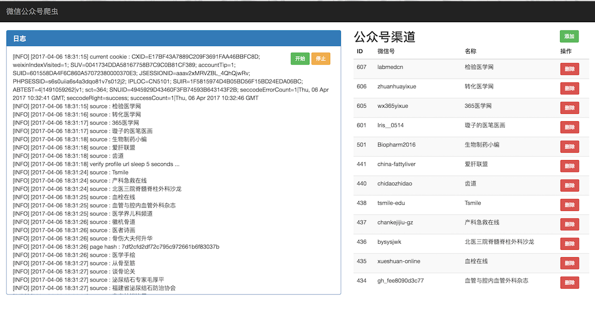

## 微信公众号爬虫

#### 准备工作

* 安装 [Python 2.7](https://www.python.org/download/releases/2.7/)

* 搭建Python虚拟环境, 详见 [virtualenv](http://pythonguidecn.readthedocs.io/zh/latest/dev/virtualenvs.html)

```bash
$ pip install virtualenv
$ virtualenv venv
$ source venv/bin/activate
$ pip install -r requirements.txt
```

#### 运行

```bash
$ cp .env.example .env
$ python run app.py
```

在浏览器中打开 `http://localhost:5000/`


